# OpenClaw技术架构分析

#架构 #AI #Agent #Gateway #TypeScript #多Agent协作

> 通过CodeBuddy分析OpenClaw源码生成的完整技术架构文档

---

## 一、项目定位

OpenClaw 是一个**个人 AI 助手网关**（Multi-channel AI Gateway），运行在用户自己的设备上,通过多种消息通道（WhatsApp、Telegram、Discord、Slack、Signal、iMessage、飞书、微信等 20+ 渠道）提供 AI 对话能力。Gateway 是控制平面,核心产品是 AI 助手本身。

---

## 二、技术栈

| 层面 | 技术选型 |
|------|---------|
| 语言 | TypeScript (ESM),严格类型 |
| 运行时 | Node.js 22+(Bun 可选用于开发/测试) |
| 包管理 | pnpm(monorepo workspace) |
| 构建 | tsdown (bundler) + tsc (DTS) |
| Lint/Format | Oxlint + Oxfmt |
| 测试 | Vitest + V8 coverage |
| Schema 校验 | Zod + AJV |
| HTTP 服务 | Express 5 |
| WebSocket | ws |
| 移动端 | Swift (macOS/iOS)、Kotlin (Android) |

---

## 三、整体架构图

```mermaid
graph TB
subgraph "客户端 (Clients)"
CLI["CLI (commander)"]
TUI["TUI 终端交互"]
WebUI["Web Control UI"]
MacApp["macOS/iOS App (Swift)"]
AndroidApp["Android App (Kotlin)"]
end

subgraph "Gateway 核心 (Control Plane)"
Entry["entry.ts / index.ts"]
CLIProg["CLI Program (commander)"]
GatewayServer["Gateway Server<br/>(HTTP + WebSocket)"]
AuthLayer["Auth & Security Layer<br/>(token/device auth, rate limit, CORS)"]
ConfigMgr["Config Manager<br/>(Zod schema, hot-reload, migration)"]
end

subgraph "消息通道层 (Channels)"
CoreChannels["Core Channels<br/>Telegram / WhatsApp / Discord<br/>Slack / Signal / iMessage / IRC<br/>Google Chat / LINE"]
ExtChannels["Extension Channels<br/>Feishu / Matrix / MS Teams<br/>Mattermost / Nostr / Twitch<br/>Zalo / BlueBubbles / Tlon / ..."]
ChannelRegistry["Channel Registry<br/>(Plugin System)"]
end

subgraph "AI 引擎层 (Agent Engine)"
AutoReply["Auto-Reply Pipeline<br/>(dispatch → directives → get-reply)"]
AgentRunner["Agent Runner<br/>(LLM 调用, tool execution, streaming)"]
ModelCatalog["Model Catalog & Auth<br/>(多 Provider, failover, OAuth)"]
SessionMgr["Session Manager<br/>(transcript, compaction, fork)"]
ContextEngine["Context Engine"]
MemoryMgr["Memory Manager<br/>(embeddings, vector search, SQLite-vec)"]
end

subgraph "工具与能力 (Tools & Capabilities)"
BashTools["Bash/Exec Tools<br/>(sandbox, approval, PTY)"]
BrowserCtrl["Browser Control<br/>(Playwright, CDP, Chrome ext)"]
ACPBinding["ACP Protocol<br/>(Agent Client Protocol)"]
MediaPipe["Media Pipeline<br/>(image, audio, PDF, ffmpeg)"]
CronService["Cron Service<br/>(scheduled tasks, heartbeat)"]
Hooks["Hooks System<br/>(lifecycle hooks, plugins)"]
TTS["TTS (Text-to-Speech)"]
Canvas["Canvas Host<br/>(live rendering)"]
end

subgraph "插件系统 (Plugin System)"
PluginSDK["Plugin SDK<br/>(openclaw/plugin-sdk)"]
PluginRuntime["Plugin Runtime<br/>(loader, registry, lifecycle)"]
PluginHTTP["Plugin HTTP Routes"]
end

subgraph "基础设施 (Infrastructure)"
Logging["Structured Logging (tslog)"]
SecretsMgr["Secrets Manager"]
Discovery["Service Discovery<br/>(Bonjour/mDNS, Tailscale)"]
Daemon["Daemon (launchd/systemd)"]
DevicePairing["Device Pairing"]
UpdateCheck["Update Checker"]
end

CLI --> CLIProg
TUI --> CLIProg
CLIProg --> Entry
Entry --> GatewayServer
WebUI --> GatewayServer
MacApp --> GatewayServer
AndroidApp --> GatewayServer

GatewayServer --> AuthLayer
GatewayServer --> ConfigMgr
GatewayServer --> ChannelRegistry

ChannelRegistry --> CoreChannels
ChannelRegistry --> ExtChannels

CoreChannels --> AutoReply
ExtChannels --> AutoReply

AutoReply --> AgentRunner
AgentRunner --> ModelCatalog
AgentRunner --> SessionMgr
AgentRunner --> ContextEngine
AgentRunner --> MemoryMgr
AgentRunner --> BashTools
AgentRunner --> BrowserCtrl
AgentRunner --> ACPBinding
AgentRunner --> MediaPipe

GatewayServer --> CronService
GatewayServer --> Hooks
GatewayServer --> Canvas
GatewayServer --> PluginRuntime

PluginRuntime --> PluginSDK
PluginRuntime --> PluginHTTP

GatewayServer --> Logging
GatewayServer --> SecretsMgr
GatewayServer --> Discovery
GatewayServer --> Daemon
GatewayServer --> DevicePairing

style GatewayServer fill:#2563eb,color:#fff
style AutoReply fill:#7c3aed,color:#fff
style AgentRunner fill:#7c3aed,color:#fff
style ChannelRegistry fill:#059669,color:#fff
style PluginSDK fill:#d97706,color:#fff
```

---

## 四、核心模块详解

### 1. 入口与 CLI (`src/entry.ts` → `src/cli/` → `src/commands/`)

- `entry.ts` 是 CLI 入口,处理进程初始化、环境变量规范化、编译缓存
- `src/cli/program.ts` 使用 **commander** 构建 CLI 命令树
- `src/commands/` 包含 ~361 个文件,涵盖所有命令

### 2. Gateway 服务器 (`src/gateway/`)

这是整个系统的**控制平面核心**(~349 文件),负责:

- **HTTP + WebSocket 服务**:Express 5 HTTP 服务器 + ws WebSocket 服务
- **认证与授权**:支持 token 认证、设备认证、速率限制
- **OpenAI 兼容 API**:暴露 OpenAI 兼容的 HTTP 接口
- **频道管理**:管理所有消息渠道的生命周期
- **配置热重载**:监听配置文件变化并实时生效
- **插件加载**:启动时加载和管理插件
- **定时任务**:Cron 服务调度
- **Control UI**:Web 管理界面
- **服务发现**:Bonjour/mDNS + Tailscale 暴露

### 3. 消息通道层 (`src/channels/` + 各通道目录)

**核心通道**(内建):
- `src/telegram/` - Telegram Bot API (grammy)
- `src/discord/` - Discord Bot (discordjs)
- `src/slack/` - Slack (@slack/bolt)
- `src/signal/` - Signal
- `src/imessage/` - iMessage
- `src/web/` - WhatsApp Web (@whiskeysockets/baileys)
- `src/line/` - LINE

**扩展通道**(Plugin):
- `extensions/feishu/` - 飞书 (@larksuiteoapi/node-sdk)
- `extensions/matrix/` - Matrix
- `extensions/msteams/` - Microsoft Teams
- 还有 IRC、Mattermost、Nostr、Twitch、Zalo等

通道系统通过 **Plugin 适配器模式** 统一接口:
```
ChannelPlugin → {
  ChannelSetupAdapter (配置/初始化)
  ChannelMessagingAdapter (收发消息)
  ChannelOutboundAdapter (发送消息)
  ChannelStreamingAdapter (流式输出)
  ChannelThreadingAdapter (线程/话题)
  ChannelPairingAdapter (用户配对)
  ChannelSecurityAdapter (安全策略)
  ...
}
```

### 4. AI 引擎层 (`src/auto-reply/` + `src/agents/`)

**消息处理流水线**:
1. **入站消息** → `inbound-debounce` (防抖) → `dispatch.ts` (分发)
2. **指令解析** → `directives.ts` (识别 `/think`, `/verbose`, `/model` 等指令)
3. **命令处理** → `commands.ts` (处理 `/reset`, `/compact`, `/status` 等斜杠命令)
4. **回复生成** → `get-reply.ts` → `agent-runner.ts` (调用 LLM)
5. **流式输出** → `block-streaming.ts` → `reply-dispatcher.ts` (分块发送到渠道)

**Agent 系统** (`src/agents/`,~823 文件):
- **模型管理**:多 Provider 支持(OpenAI、Anthropic、Google Gemini、Bedrock、Ollama、自定义 API 等),自动 failover
- **Auth Profile**:OAuth + API Key 轮转、冷却策略
- **Context 管理**:上下文窗口管理、自动压缩
- **工具调用**:Bash 执行、频道操作
- **CLI 后端**:对接 Claude CLI 等外部后端

### 5. 插件系统 (`src/plugins/` + `src/plugin-sdk/` + `extensions/`)

- **Plugin SDK**:暴露为 `openclaw/plugin-sdk`,提供完整的类型定义和适配器接口
- **Plugin Runtime**:插件加载器、注册表、生命周期管理
- **Hooks**:生命周期钩子(before-agent-start, after-tool-call, message preprocess 等)
- **Extensions**:各扩展通道/功能的独立包

### 6. 记忆系统 (`src/memory/`)

- 基于 **SQLite-vec** 的向量存储
- 支持多种 Embedding Provider(OpenAI、Gemini、Voyage、Mistral、Ollama)
- MMR(最大边际相关性)搜索
- 批量嵌入管理
- QMD(查询驱动记忆)范围管理

### 7. 浏览器控制 (`src/browser/`)

- 基于 **Playwright** 的浏览器自动化
- CDP (Chrome DevTools Protocol) 直连
- Chrome Extension 中继
- 截图、导航、表单填充等 AI 工具

### 8. ACP 协议 (`src/acp/`)

- 实现 **Agent Client Protocol** (ACP)
- 支持 agent spawn/stream、持久化绑定
- 会话映射与翻译层

### 9. 基础设施 (`src/infra/`)

- 进程管理(respawn、锁文件、端口探测)
- 环境检测(dotenv、路径安全)
- 执行审批(exec approvals、安全二进制白名单)
- 设备配对与发现
- 更新检查

---

## 五、数据流概览

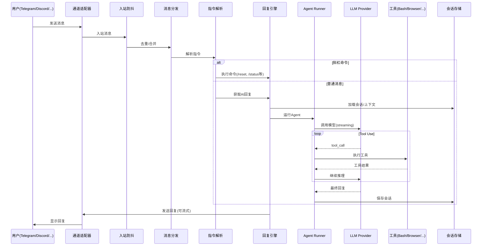

---

## 六、多 Agent 协作架构

### 协作架构图

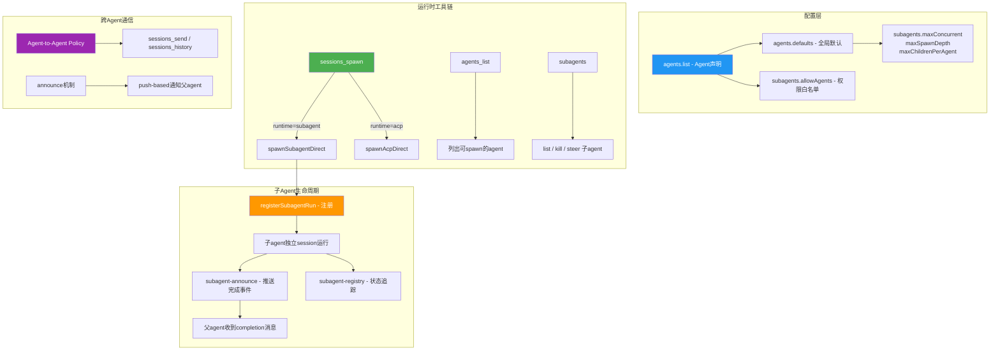

### 核心协作工具

| 工具 | 功能 |
|------|------|
| `sessions_spawn` | 生成子 agent 会话(一次性 `run` 或持久 `session`) |
| `agents_list` | 列出当前 agent 可以 spawn 的其他 agent(受白名单约束) |
| `subagents` | 管理已生成的子 agent(list / kill / steer) |

### 协作流程

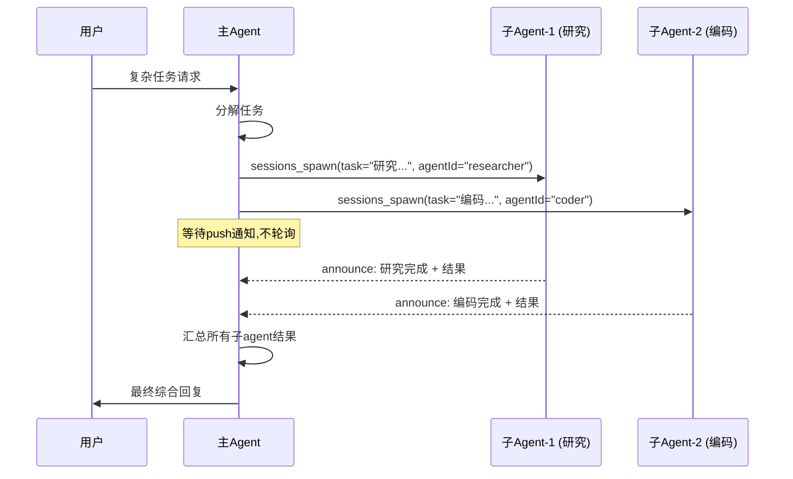

---

## 七、Agent 间通信协议

### 传输层: Gateway WebSocket 协议

| 帧类型 | `type` 字段 | 用途 |
|--------|-----------|------|
| **RequestFrame** | `"req"` | 客户端→Gateway 的 RPC 调用(method + params) |
| **ResponseFrame** | `"res"` | Gateway→客户端 对 req 的同步应答(ok/error) |
| **EventFrame** | `"event"` | Gateway→客户端 的异步事件推送(event name + payload) |

### Announce 投递策略

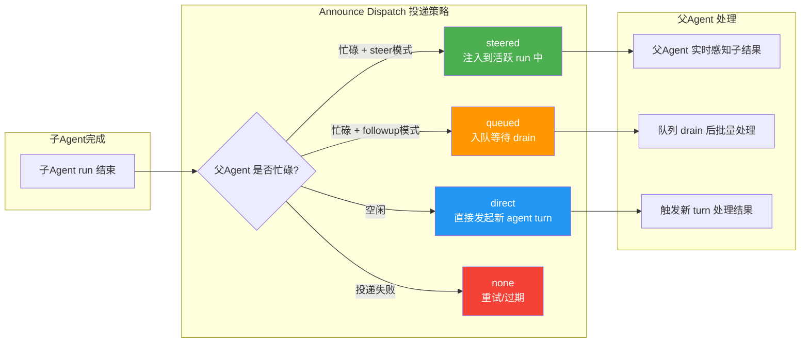

### Steered 模式详解

**Steered 模式**是一种实时消息注入机制。当配置 `queue.mode = "steer"` 时,子 agent 的完成结果可以**直接注入到父 agent 当前活跃的 run 中**,而不需要等待父 agent 完成当前 turn。

**核心机制**: `activeSession.steer(text)` 将消息注入到当前 Turn 的 Agentic Loop 中,作为新的 user 角色消息追加到对话历史。

| 特性 | Steer 模式 | Followup/Queue 模式 |
|------|-----------|-------------------|
| **消息位置** | 注入到当前 Turn 的消息历史 | 等待当前 Turn 结束后作为新 Turn 的输入 |
| **LLM 感知时机** | 当前 Turn 的下一次 LLM 调用 | 下一个 Turn 的首次 LLM 调用 |
| **上下文连贯性** | 极高(同一 Turn 内) | 中等(新 Turn,但有历史) |
| **处理延迟** | 最低(毫秒级) | 较高(需等待 Turn 结束 + 新 Turn 启动) |

### Turn (轮次) 概念

**Turn(轮次)** 是 Agent 执行的一个完整"回合":

```
Turn (轮次)
├── Agentic Loop (智能体循环)
│   ├── LLM Call #1 → 决定调用 tool_A
│   ├── Tool Execution: tool_A
│   ├── LLM Call #2 → 决定调用 tool_B
│   ├── Tool Execution: tool_B
│   ├── LLM Call #3 → 生成最终回复
│   └── [循环结束]
└── [Turn 结束]
```

| 概念 | 粒度 | 触发条件 | 示例 |
|------|------|---------|------|
| **LLM Call** | 最小 | 每次调用模型 API | `claude.complete(...)` |
| **Agentic Loop** | 中等 | 工具调用链 | 读文件→分析→写文件 |
| **Turn** | 最大 | 用户输入触发 | 用户发一条消息 |

---

## 八、多 Agent 管理机制

### 管理架构

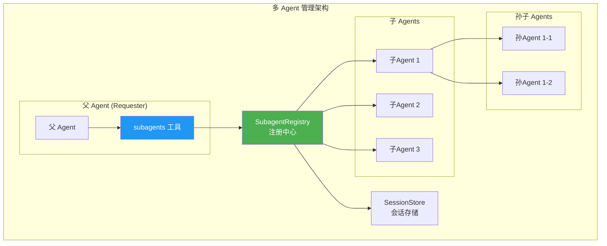

### 生命周期管理

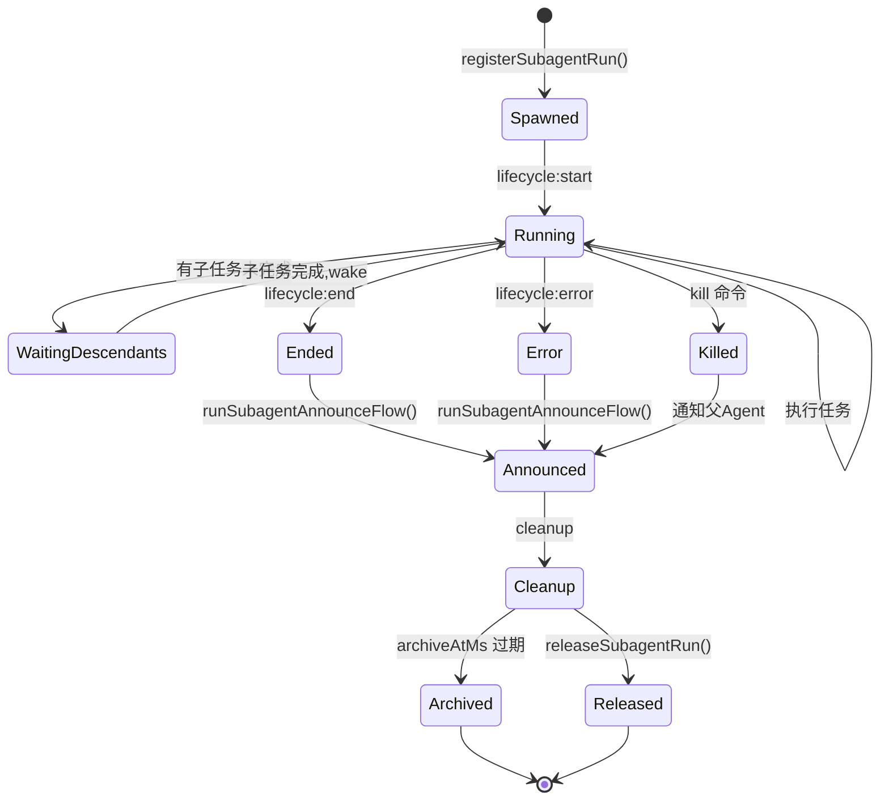

### 管理功能总结

| 功能 | 实现位置 | 说明 |
|------|----------|------|
| **注册/追踪** | `subagent-registry.ts` | 所有子 Agent 的中央注册表 |
| **Spawn** | `subagent-spawn.ts` | 创建子 Agent,设置深度/数量限制 |
| **List/Kill/Steer** | `subagents-tool.ts` | 父 Agent 管理子 Agent 的工具 |
| **生命周期监听** | `subagent-registry.ts` | 监听 start/end/error 事件 |
| **Announce** | `subagent-announce.ts` | 子 Agent 完成时通知父 Agent |
| **后代等待** | `wakeSubagentRunAfterDescendants()` | orchestrator 等待其子任务完成 |
| **持久化** | `subagent-registry-state.ts` | 跨重启恢复运行状态 |

---

## 九、Agent 与 Gateway 的耦合关系

### 架构关系

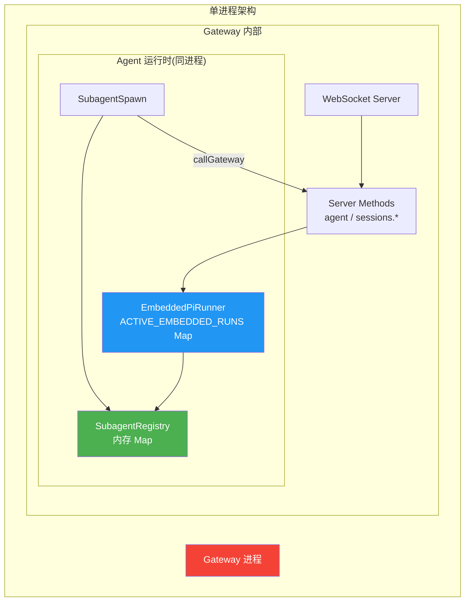

### 关键点

- Agent 并非独立进程,而是以 **嵌入式运行** (Embedded Run) 的方式运行在 Gateway 进程内部
- 所有活跃的 Agent 运行都保存在 `ACTIVE_EMBEDDED_RUNS` 这个**内存 Map** 中
- Gateway 退出 = Agent 立即中断
- SubagentRegistry 的**元数据**会持久化到磁盘,Gateway 重启后可恢复注册表记录

| 问题 | 回答 |
|------|------|
| Agent 与 Gateway 解耦吗? | **否**,Agent 嵌入在 Gateway 进程中运行 |
| Gateway 退出后 Agent 还能运行吗? | **不能**,Agent 会立即中断 |
| 有恢复机制吗? | 有部分恢复:SubagentRegistry 的**元数据**会持久化到磁盘 |
| Agent 是独立进程吗? | **不是**,是 Gateway 进程内的异步任务 |
| 通信方式? | Agent 通过 `callGateway()` 走 WebSocket loopback 回连 Gateway 自身 |

---

## 十、会话管理架构

### 整体架构

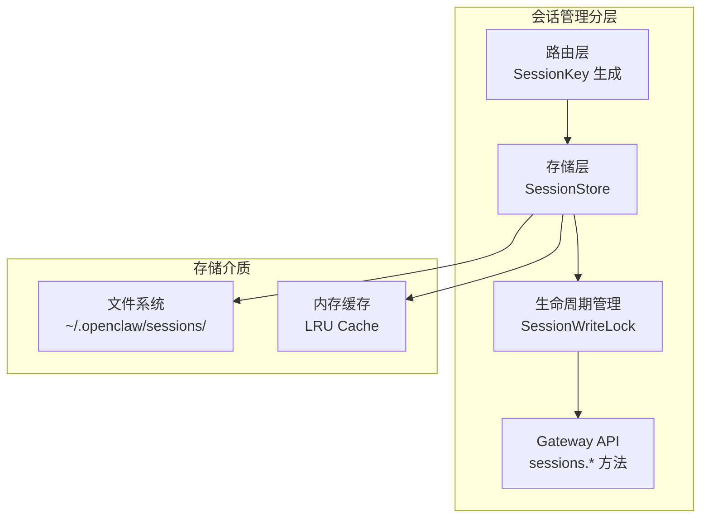

### 存储架构

```
~/.openclaw/sessions/
├── store.json              # 主存储文件
├── store.json.bak         # 备份文件
├── transcripts/           # 对话记录
│   ├── {sessionId}/
│   │   ├── transcript.jsonl
│   │   └── metadata.json
│   └── ...
└── locks/                 # 写锁文件
```

### 核心组件

| 组件 | 职责 | 存储位置 |
|------|------|----------|
| **SessionKey** | 唯一标识会话(渠道+联系人) | 内存 |
| **SessionStore** | 管理所有会话的元数据 | `~/.openclaw/sessions/store.json` + LRU 缓存 |
| **SessionEntry** | 单个会话的完整信息 | SessionStore 中 |
| **Transcript** | 对话历史记录 | `~/.openclaw/sessions/transcripts/{sessionId}/` |
| **SessionWriteLock** | 防止并发修改 | 内存 Map + 文件锁 |

**关键设计特点**:
1. **文件持久化** - 会话数据存储在文件系统,Gateway 重启不丢失
2. **LRU 缓存** - 热会话保持在内存中,提高访问速度
3. **写锁机制** - 防止同一会话被并发修改
4. **JSONL Transcript** - 对话记录使用追加模式,性能高效
5. **渠道无关** - SessionKey 抽象了不同渠道的差异

---

## 十一、Agent 通过 Session 与通道通信

### 通信流程

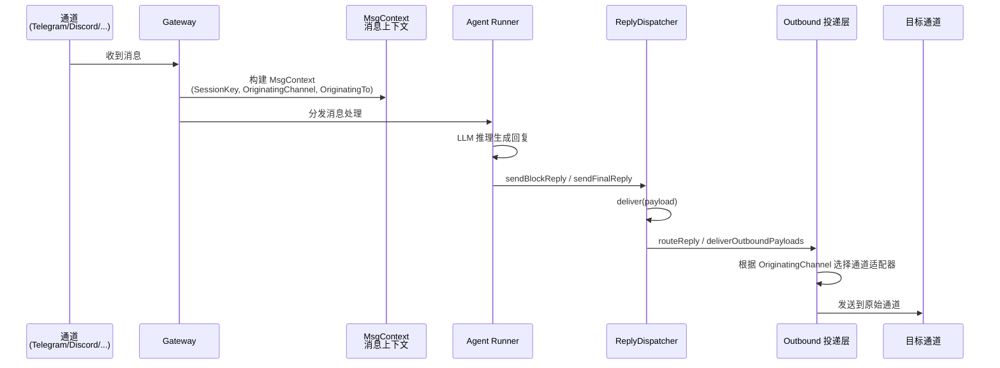

### MsgContext - 通信的核心

Agent 通过 `MsgContext` 获取回复路由信息:
- `SessionKey` - 会话标识,用于定位会话
- `OriginatingChannel` - 源通道,回复应该发回哪个渠道
- `OriginatingTo` - 源目标,回复应该发送到的 chat/channel/user ID
- `MessageThreadId` - 线程 ID

### Outbound 投递层

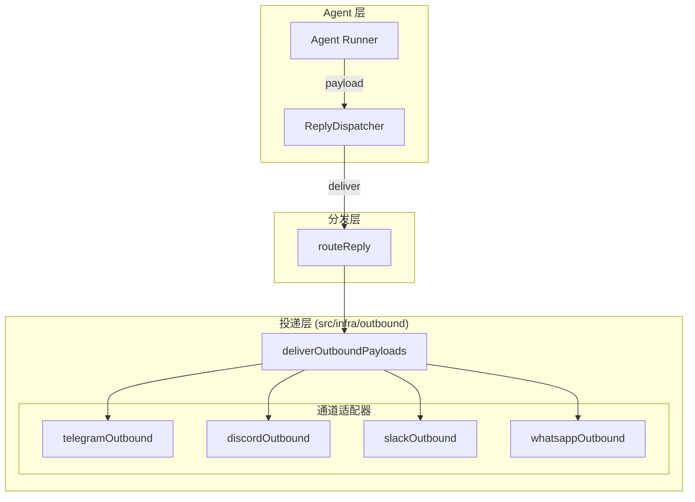

### 通信机制总结

| 组件 | 职责 |
|------|------|
| **MsgContext** | 携带路由信息 (SessionKey, OriginatingChannel, OriginatingTo) |
| **ReplyDispatcher** | 队列化回复,调用 deliver 回调 |
| **routeReply** | 根据 OriginatingChannel 路由到正确通道 |
| **deliverOutboundPayloads** | 规范化 payload,分块,投递 |
| **ChannelOutboundAdapter** | 通道特定的发送实现 (telegram/discord/...) |
| **Session** | 提供上下文、历史记录、路由回退 |

**关键设计**:
1. **OriginatingChannel 优先** - 回复优先发回消息的源通道
2. **Dispatcher 串行化** - 保证 tool → block → final 的发送顺序
3. **通道适配器解耦** - 每个通道独立实现 outbound adapter
4. **Mirror 机制** - 自动将 AI 回复记录到 transcript

---

## 十二、配置系统

- 主配置文件:`~/.openclaw/openclaw.json`(开发模式:`~/.openclaw-dev/openclaw.json`)
- **Zod Schema** 驱动的完整校验
- 支持热重载、配置迁移、环境变量替换、includes 合并
- 敏感信息通过 Secrets Manager 管理

---

## 十三、部署模式

| 模式 | 说明 |
|------|------|
| 全局 CLI | `npm i -g openclaw@latest` + `openclaw gateway run` |
| Daemon | launchd (macOS) / systemd (Linux) 守护进程 |
| Docker | `Dockerfile` + `docker-compose.yml` |
| 原生 App | macOS App (Swift)、iOS App、Android App (Kotlin) |
| 开发模式 | `pnpm gateway:watch` 热重载开发 |

---

## 十四、总结

OpenClaw 是一个架构非常丰富的项目,代码量约 **5000+ TypeScript 文件**,涵盖了 AI 网关的完整生命周期:从多渠道消息接入、AI 模型调用、工具执行、会话管理、到插件扩展和安全审计。

**核心设计哲学**:
- **单用户、本地优先** - 运行在用户自己的设备上
- **多渠道统一** - 通过统一的 Gateway 接入 20+ 消息渠道
- **Agent 嵌入式运行** - Agent 作为 Gateway 进程的一部分运行
- **推送式通信** - 子 Agent 通过 announce 机制主动推送结果
- **文件持久化** - 会话和配置数据存储在文件系统
- **插件可扩展** - 通过 Plugin SDK 支持第三方扩展

---

## 相关链接

- 原始分析文档: `/Users/coriase/work/obsidian/tech/tech/架构.md`
- 分析时间: 2026-03-21
- 分析工具: CodeBuddy

---

## 标签索引

#架构分析 #OpenClaw #AI助手 #多Agent系统 #WebSocket #Gateway模式 #消息通道 #会话管理 #TypeScript #Node.js
